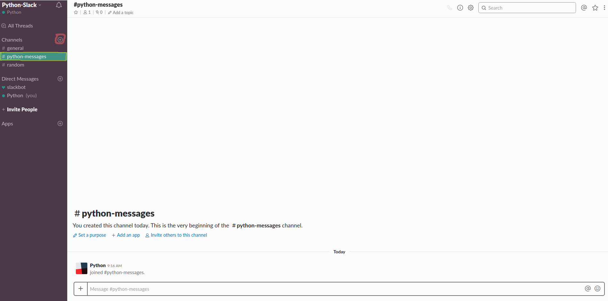
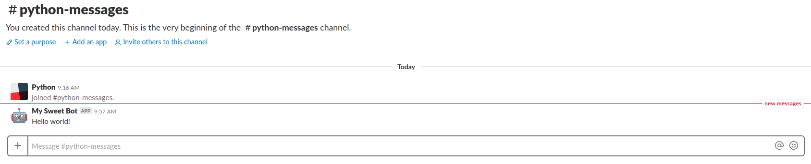

# Python Slack Logging

We will explain how to use Slack in our Python programs to be able to send messages to our Slack channels. This will send notifications to our devices where we have Slack open, such as the computer or mobile phone and it will help us not to have to be looking if our process has finished or not and we can also send us a summary of the results obtained with the most relevant information. Let's go.

The first thing we're going to have to do is create a [Slack](https://slack.com) account if we did not have one and create a workspace with the name we want. After creating our workspace and account, and having completed the tutorial on how to use the platform, we have to create a channel with the name we want to send our messages from Python. We have created the channel "python-messages".



With this we go to the installation of the necessary packages, specifically the slack client for Python.

```sh
$ pip install slackclient==1.3.1
```

With this we can move to our Python script where we can create a small function that allows us to send messages. (More information [here](https://pypi.org/project/slackclient/)).

```python
def slack_message(slack_token, message, channel):
    token = slack_token
    sc = SlackClient(token)
    sc.api_call('chat.postMessage', channel=channel, 
                text=message, username='My Sweet Bot',
                icon_emoji=':robot_face:')
```

Where "slack_tocken" is a token that is generated on the following [page](https://api.slack.com/custom-integrations/legacy-tokens) in the section "Legacy token generator". "Message" is the message we want to send to our channel defined by "channel".

For example, we could call the function as follows.

```python
slack_token = "my-slack-token-generated" # Example of slack token
slack_message(slack_token, "Hello world!", "python-message")
```

Generating a notification on our mobile or device where we have Slack.



## Extras

Finally I leave a script [slack_sender](slack_sender.py) to invoke it from the command line that receives as arguments the "slack_token", "message" and "channel".

```sh
$ python3 slack_sender.py --slack_token "my_token" --msg "Hello world!" --channel "python-messages"
```

---
Thank you. Any problem do not hesitate to contact me maparla@inf.upv.es